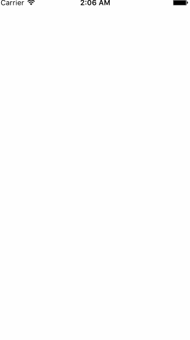
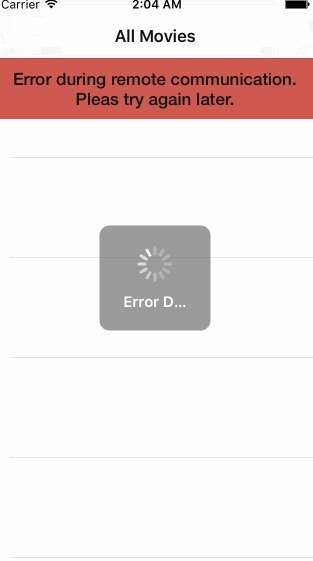

# Project 1 - RottenTomatoes

RottenTomatoes is a movies app displaying box office and top rental DVDs using the [Rotten Tomatoes API](http://developer.rottentomatoes.com/docs/read/JSON).

Time spent: **5** hours spent in total

## User Stories

The following **required** functionality is completed:

- [x] User can view a list of movies. Poster images load asynchronously.
- [x] User can view movie details by tapping on a cell.
- [x] User sees loading state while waiting for the API.
- [x] User sees error message when there is a network error.
- [x] User can pull to refresh the movie list.

The following **optional** features are implemented:

- [ ] Add a tab bar for Box Office and DVD.
- [ ] Implement segmented control to switch between list view and grid view.
- [ ] Add a search bar.
- [ ] All images fade in.
- [ ] For the large poster, load the low-res image first, switch to high-res when complete.
- [ ] Customize the highlight and selection effect of the cell.
- [ ] Customize the navigation bar.

Here's a walkthrough of implemented user stories:

GIF created with [LiceCap](http://www.cockos.com/licecap/).
